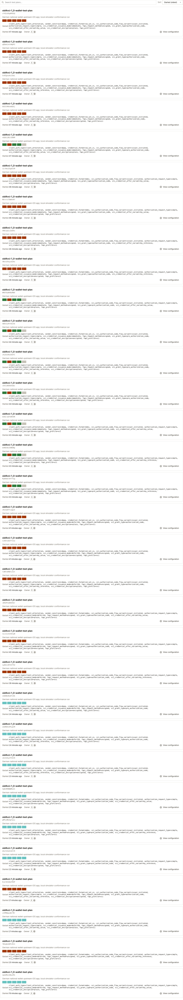
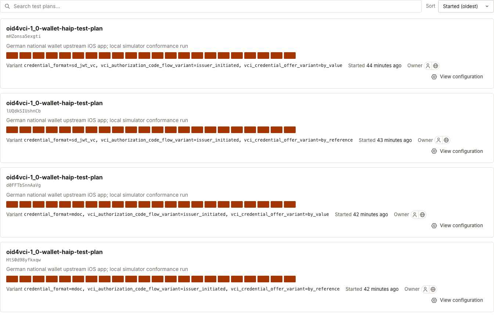
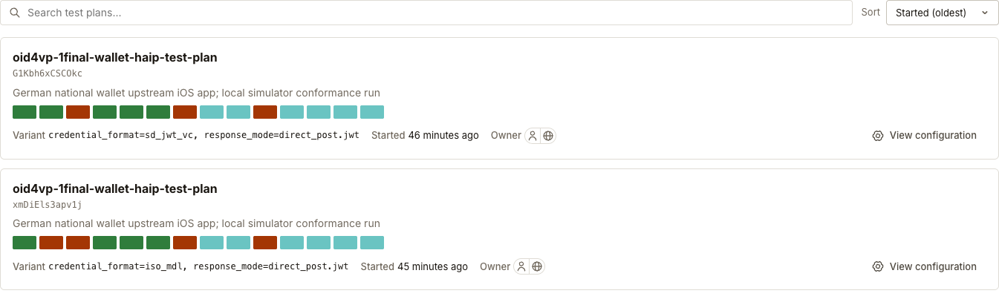

# German EUDI Wallet conformance tests

Run the OpenID Foundation's OpenID4VCI and OpenID4VP tests against the [German EUDI Wallet iOS app](https://github.com/german-national-wallet/de-eudi-wallet-ios). Issuance covers both Final (for pre-authorized code tests) and the High Assurance Interoperability Profile (HAIP). Presentation uses HAIP. Only iOS is tested for now.

## iOS setup

Install the [prerequisites](docs/ios-runbook.md#prerequisites), then run:

```bash
git clone --recurse-submodules https://github.com/dominikschlosser/german-wallet-conformance.git
cd german-wallet-conformance
scripts/run-conformance.sh
```

The command starts the suite and wallet backend, builds the app and runs the tests. The backend supplies wallet registration and attestations. Both the backend and official app are pinned submodules. [Local build files](ios-app/README.md) supply missing resources without changing the app's Swift implementation.

Use `--workers 4` for parallel tests, or a higher even count such as `--workers 12` for more issuance simulators. See the [iOS runbook](docs/ios-runbook.md) for a small sample, resuming a run and reading logs.

## iOS results

**Three plans, 38 variants included.** Each variant combines settings such as credential format, grant type and immediate or deferred issuance. VCI Final adds coverage for pre-authorized issuance and combinations of offer delivery and credential response encryption.

Versions: suite **release-v5.2.4** with a local [SD-JWT configuration patch](docs/ios-results.md#sd-jwt-issuance-and-german-pid-enrollment), app **`c4c961c`**, backend wrapper **`b1bd7a8`**.

| Suite plan | Variants run | Passed | Failed | Review | Skipped |
| --- | ---: | ---: | ---: | ---: | ---: |
| `oid4vci-1_0-wallet-test-plan` | 32 | 24 | 88 | 40 | 8 |
| `oid4vci-1_0-wallet-haip-test-plan` | 4 | 0 | 88 | 0 | 0 |
| `oid4vp-1final-wallet-haip-test-plan` (`direct_post.jwt`) | 2 | 9 | 7 | 12 | 0 |
| **Total** | **38** | **33** | **183** | **52** | **8** |

**Skipped** is the suite's verdict for tests within the variants run. The two `dc_api.jwt` variants, one per credential format, were **not run** because the iOS app has no Digital Credentials API integration. They are not included in the table.

Basic pre-authorized issuance and presentation pass for both formats. Every failed test contains at least one documented wallet finding. The same finding can affect several tests and variants.

[iOS result details](docs/ios-results.md) explain each finding. [Test logs](docs/ios-test-logs.md) are listed by plan, variant and failed test. Each test page links its wallet and suite logs.

### Suite overviews

Each square is one test. **Green means passed, red failed, teal review and yellow warning.** Grey covers skipped tests, tests not run and interrupted tests without a verdict.

<details>
<summary>oid4vci-1_0-wallet-test-plan: 32 variants</summary>



</details>

<details>
<summary>oid4vci-1_0-wallet-haip-test-plan: 4 issuer initiated variants</summary>



</details>

<details>
<summary>oid4vp-1final-wallet-haip-test-plan: 2 direct_post.jwt variants</summary>



</details>

## iOS skipped and untested cases

- **Wallet initiated issuance:** the app starts PID enrollment through its eID flow. This setup cannot complete that flow, so these variants are excluded automatically.
- **German PID enrollment:** requires an eID server that this setup does not provide. A [suite patch](suite/sdjwt-configuration.patch) enables SD-JWT issuance with ordinary JWT proofs. Attestation proofs and key attestation remain untested.
- **Issuer metadata:** nginx removes `mtls_endpoint_aliases`, which lists URLs for client certificate authentication, because the wallet cannot decode the suite's version of this field. These results therefore do not cover metadata containing it.
- **Batch issuance:** eight tests are Skipped because the wallet requests only one credential. There is no batch to check.

## Android

Placeholders: [Android runbook](docs/android-runbook.md) and [Android results](docs/android-results.md).

## License

[EUPL-1.2](LICENSE). Upstream components retain their licenses, including Apache-2.0. See [NOTICE](NOTICE).
