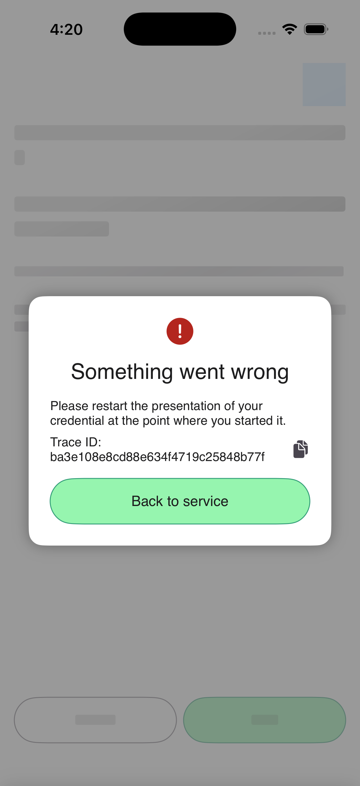

# iOS results

See the [README](../README.md#ios-results) for totals and coverage. This page explains the iOS wallet behavior behind the results.

## Credential issuance

### Credential identifiers are ignored

The issuer supplies a driving licence identifier in the token response's `credential_identifiers`. The wallet then requests that credential using `credential_configuration_id` instead of `credential_identifier`.

[OpenID4VCI 1.0 Final §8.2](https://openid.net/specs/openid-4-verifiable-credential-issuance-1_0.html#section-8.2) requires the supplied identifier. This confirms upstream [issue #12](https://github.com/german-national-wallet/issues-tracker-ios/issues/12). The suite accepts the request, so this finding comes from inspecting the exchange rather than a failed suite check.

### The authorization request repeats `state` after PAR

After a Pushed Authorization Request (PAR), the wallet sends `state` in the browser request alongside `client_id` and `request_uri`. Both issuance plans mark the extra parameter as a failure under the [FAPI 2.0 Final authorization request rules](https://openid.net/specs/fapi-security-profile-2_0-final.html#section-5.3.3.2).

### Notifications omit the DPoP proof

The wallet sends a credential notification using Bearer authentication, although the access token is bound to a DPoP key. The request lacks the proof required by [DPoP §7](https://www.rfc-editor.org/rfc/rfc9449.html#section-7) to demonstrate possession of that key.

### Incorrect discovery metadata is accepted

The suite returns discovery metadata with an `issuer` that differs from the URL used to retrieve it. The wallet continues by sending a PAR request. [OAuth metadata §3.3](https://www.rfc-editor.org/rfc/rfc8414.html#section-3.3) requires rejecting that mismatch.

### Valid mTLS endpoint metadata is rejected

The wallet's metadata decoder requires all eight endpoint URLs inside `mtls_endpoint_aliases`. It rejects the valid example in [RFC 8705 §5](https://www.rfc-editor.org/rfc/rfc8705.html#section-5), which supplies only token, revocation and introspection URLs. The standard allows individual endpoints to be omitted.

Local nginx removes this field so issuance can proceed. This finding is therefore not reflected in the suite's failure totals, and mTLS remains untested.

### Invalid authorization responses are accepted

The wallet exchanges the authorization code when the response has an incorrect or missing issuer parameter, `iss`, contrary to the [issuer validation rules](https://www.rfc-editor.org/rfc/rfc9207.html#section-2.4). It also continues when `state` is absent. These responses should be rejected. A response with an incorrect state value is rejected as expected.

### Issuance stops without `expires_in`

When the token response omits `expires_in`, the wallet reports that the credential cannot be added. [OAuth 2.0 §5.1](https://www.rfc-editor.org/rfc/rfc6749.html#section-5.1) recommends this field but does not require it.

### Token type parsing is case sensitive

The suite returns `token_type: "dpOp"`. The wallet treats the token as Bearer and sends its credential request without a DPoP proof, so issuance stops. [OAuth 2.0 §5.1](https://www.rfc-editor.org/rfc/rfc6749.html#section-5.1) defines token type values as case insensitive.

### Deferred credentials are not retrieved

The suite returns a transaction ID and asks the wallet to retrieve the credential after five seconds, using the [deferred credential endpoint](https://openid.net/specs/openid-4-verifiable-credential-issuance-1_0.html#section-9). The wallet shows “Adding credential ...”. Tapping Next returns to the dashboard, which does not start retrieval. The suite receives no request at that endpoint.

The app stores the deferred transaction, but its current dashboard has no path to retrieve it. The runner opens the offer, confirms the pending screen and waits up to three minutes. Tests that reach this point remain incomplete.

## Credential presentation

### Fetching a request by POST omits the Accept header

The wallet fetches the request without `Accept: application/oauth-authz-req+jwt`. [OpenID4VP 1.0 Final §5.10](https://openid.net/specs/openid-4-verifiable-presentations-1_0.html#section-5.10) requires this header.

### The mdoc signature fails when the encryption key omits `use`

The ordinary mdoc presentation passes. When the verifier's encryption key omits `use`, the wallet leaves that key's thumbprint out of the signed session data. The signature verifies only with that omission. Encrypted responses must include the thumbprint under [OpenID4VP 1.0 Final Appendix B.2.6](https://openid.net/specs/openid-4-verifiable-presentations-1_0.html#appendix-B.2.6), so the suite rejects the signature.

### The wallet discloses claims that were not requested

For both formats, a DCQL query without `claims` returns selectively disclosable claims. [OpenID4VP 1.0 Final §6.4.1](https://openid.net/specs/openid-4-verifiable-presentations-1_0.html#section-6.4.1) allows only mandatory claims in this case.

### The wallet accepts `redirect_uri` with `direct_post.jwt`

The wallet sends a presentation when the request combines `redirect_uri` with `direct_post.jwt`. It should reject this combination under [OpenID4VP 1.0 Final §8.2](https://openid.net/specs/openid-4-verifiable-presentations-1_0.html#section-8.2).

## Setup limits

### Wallet initiated issuance

The app's own issuance entry point starts German PID enrollment through the eID flow. This setup cannot complete it, so wallet initiated variants are excluded from runs, reports and screenshots.

### SD-JWT issuance and German PID enrollment

The app interprets the suite's configuration ID `eu.europa.ec.eudi.pid.1` as a PID mdoc and requires an enrolled PID before accepting the offer. Without one, it returns `missingPid`.

The setup patches the suite to add a copy of its SD-JWT configuration. The copy uses `wallet-test-sdjwt` as its configuration ID and scope. Its credential type (`vct`) remains `urn:eudi:pid:1`, and its claims and JWT proof requirements stay the same. This avoids the ID collision and allows issuance without German PID enrollment.

German PID enrollment still needs an eID server. A [simulated card](https://www.ausweisapp.bund.de/sdk/simulator.html) does not replace that server or its [TC token](https://www.ausweisapp.bund.de/sdk/commands.html#run-auth). This setup tests neither enrollment nor attestation proofs or JWT proofs requiring key attestation.

### Batch issuance needs more than one credential

The wallet requests one credential with one proof. Eight Final tests are Skipped because there is no batch to assess. Other batch tests fail because the wallet sends an extra `state` parameter after PAR, even though batch issuance itself cannot be assessed.

## Screenshots for review

All 12 completed Review tests show the same message: “Something went wrong”, followed by a request to restart the presentation. The trace ID and capture time vary. This example shows the shared message:

